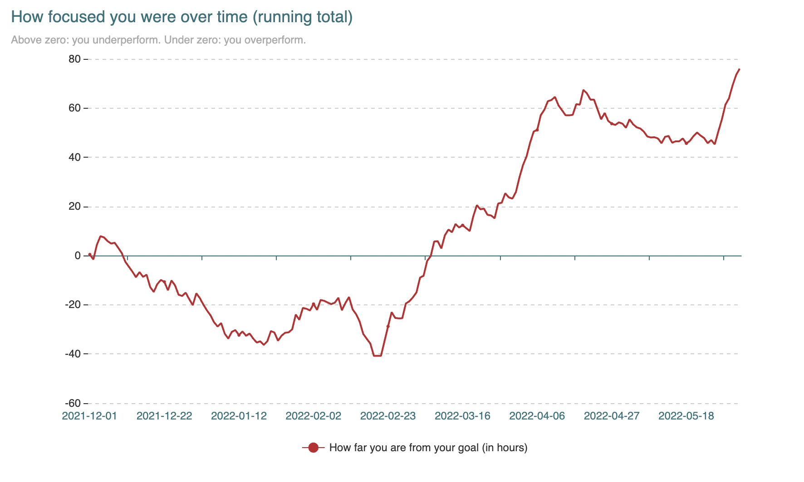

# Tracking daily focus with the [Forest](https://www.forestapp.cc/) app

So you track how much you focus, perhaps for work or your studies. Have you ever thought, "I need to focus X hours per day"? But how do you know if you're meeting this target? Enter `trackf`!

All you need is a CSV file exported from your [Forest](https://www.forestapp.cc/) app.

## Install

To start using `trackf`, install Go and run `go install`:

```
go install github.com/armmam/trackf@latest
```

## Usage

 - Navigate to ≡ → Settings → Your Profile → Export your Data
 - Transfer the `.csv` file to your computer
 - Pass the file path to `trackf`
 - Optionally, specify:
   1. How many hours per day you want to be focusing (defaults to 8)
   2. Whether you want a `.csv` file with your data or a nice chart

## Flags

```
  -begin string
        beginning of tracked period in the format YYYY-MM-DD
  -end string
        end of tracked period in the format YYYY-MM-DD
  -file string
        path to .csv file (required)
  -hours int
        target number of hours to focus per day: between 0 and 23 (default 8)
  -out string
        path to output .csv file (default "tracked_focus.csv")
  -port string
        serve http on localhost instead of writing to .csv
```

## Example

```
trackf -file plants.csv -hours 6 -port 8080
```

will make two charts available at the endpoints `/` and `/daily` on `localhost:8080`, based on all the data from `plants.csv`. The chart at `/` may look like this:

<p align="center">
  <br>
  
  <br>
</p>
